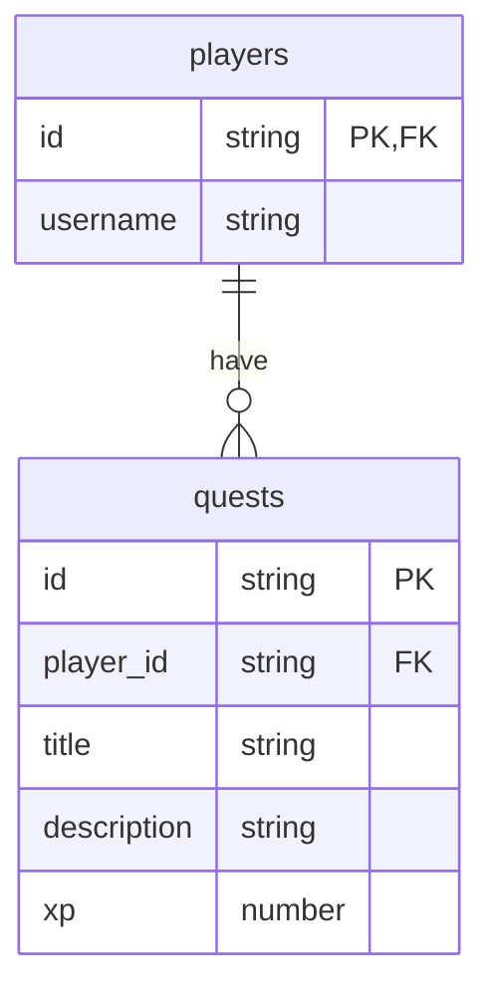

# Gamify

Application to improve its users' life by gamifying their goals and tasks.

## Features

- Add a task/goal, it's reward (number of points) and mark it as done when
  you complete it.

## Database structure

## Stack

- Frontend: React TS + Next.js deployed on Vercel
- Backend: Supabase deployed on Supabase

## Commit messages

[FEAT] - new feature ||\
[CLEAN] - refactor ||\
[BUILD] - project dependancies ||\
[FIX] - fix a bug ||\
[BUG] - introduce a feature / refactor but with a bug (to avoid)
